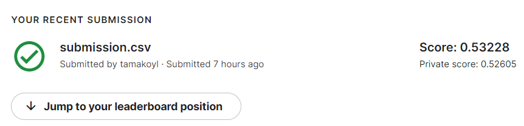
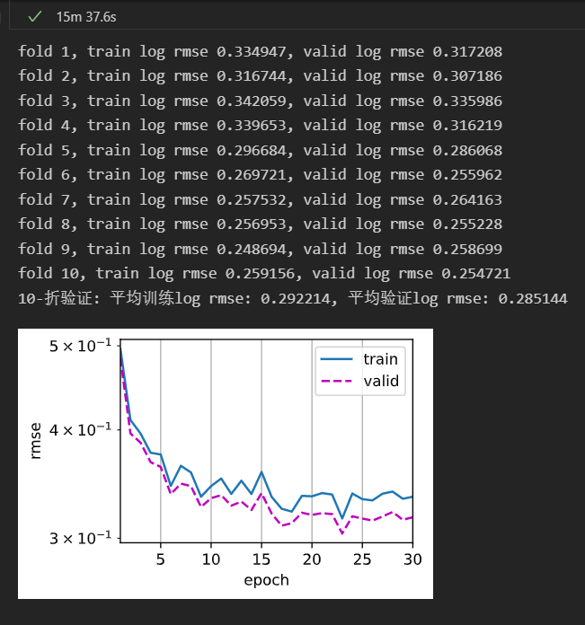

# California House Price Predict Record
## 1 实验准备
### 1.1 实验数据
### 1.2 实验数据分析及处理
## 2 实验过程
### 2.1 第一阶段
仅用数字的特征
先忽略掉其他的字符串的特征，观察仅用数字的feature训练出来的模型，尽量调整到模型的最优拟合，第二阶段
在考虑加入更多的特征
 
#### model 1
- hyperparams：
  - lr = 0.001
  - num_epochs = 20
  - weight_decay = 0
  - batch_size = 64

**models**
```py
net = nn.Sequential(
                        nn.Linear(in_features, 256),
                        nn.ReLU(),
                        nn.Linear(256,128),
                        nn.ReLU(),
                        nn.Linear(128,1),
                    
    )

```
**training**


**submit**


#### model 2
training 和 validation的loss曲线拟合度很好，尝试进一步增加模型的复杂度
- hyperparams：
lr = 0.001
num_epochs = 20
weight_decay = 0
batch_size = 64

**models**
```py
net = nn.Sequential(nn.Linear(in_features, 512),
                        nn.ReLU(),
                        nn.Dropout(0.3),
                        nn.Linear(512,256),
                        nn.ReLU(),
                        nn.Dropout(0.2),
                        nn.Linear(256,1),
    )

```
**training**

**submit**


#### model 3
training 和 validation的loss有一些gap，可能是发生了过拟合，现在尝试做一些正则，增加dropout和weight_decay
- hyperparams：
lr = 0.001
num_epochs = 20
weight_decay = 0.0001
batch_size = 64

**models**
```py
net = nn.Sequential(nn.Linear(in_features, 512),
                        nn.ReLU(),
                        nn.Dropout(0.3),
                        nn.Linear(512,256),
                        nn.ReLU(),
                        nn.Dropout(0.2),
                        nn.Linear(256,1),
    )

```

**training**


**submit**


#### model 4
限制weight的初始化，使每一层的输出都有相同的的方差
- hyperparams：
lr = 0.001
num_epochs = 20
weight_decay = 0.0001
batch_size = 64

**models**
```py
net = nn.Sequential(nn.Linear(in_features, 512),
                        nn.ReLU(),
                        nn.Dropout(0.3),
                        nn.Linear(512,256),
                        nn.ReLU(),
                        nn.Dropout(0.2),
                        nn.Linear(256,1),
    )

def init_weights(m):
    if type(m) == nn.Linear:
        nn.init.xavier_normal_(m.weight,gain=1)

net.apply(init_weights);

```

**training**


**submit**


#### model 5
尝试再增加模型的复杂度
- hyperparams：
  - lr = 0.001
  - num_epochs = 40
   - weight_decay = 0.0003
   - batch_size = 64
   - k=10

- models
```py
net = nn.Sequential(nn.Linear(in_features, 1024),
                        nn.ReLU(),
                        nn.Dropout(0.8),
                        nn.Linear(1024,512),
                        nn.ReLU(),
                        nn.Dropout(0.5),
                        nn.Linear(512,256),
                        nn.ReLU(),
                        nn.Dropout(0.2),
                        nn.Linear(256,1)
    )

def init_weights(m):
    if type(m) == nn.Linear:
        nn.init.xavier_normal_(m.weight,gain=1)

net.apply(init_weights);
```

**training**


**submit**


#### 第一阶段总结
根据已有的numerial特征，模型已经达到了极限，下一阶段尝试数字化更多特征


### 2.2 第二阶段
第二阶段，新增加一些非数字的特征，这里增加了State和Type两个特征，并将它们转化为one-hot vector，，并且发现'Last Sold Price'这一列很多na，填零的方式不太可取，现在尝试加入‘Last Sold on’的年份，缺失的填入2021，和Sold Price

<br/>增加特征后发现过拟合太严重，提交的泛化性太差，然后尝试使用更简单的模型

#### model1 
- hyperparams：
  - lr = 0.001
  - num_epochs = 40
   - weight_decay = 0.04
   - batch_size = 64

- models
```py
net = nn.Sequential(nn.Linear(in_features, 256),
                        nn.ReLU(),
                        # nn.Dropout(0.3),
                        nn.Linear(256,256),
                        nn.ReLU(),
                        # nn.Dropout(0.2),
                        nn.Linear(256,1),
    )


net.to(device)

def init_weights(m):
    if type(m) == nn.Linear:
        nn.init.xavier_normal_(m.weight,gain=1)

net.apply(init_weights);

def init_weights(m):
    if type(m) == nn.Linear:
        nn.init.xavier_normal_(m.weight,gain=1)

net.apply(init_weights);
```

**training**


**submmit**


#### model2
尝试了进一步降低过拟合，epoch减少为30，增加dropout，但是效果变差，所以在尝试增加一点模型的复杂度，在增加一层深度
- hyperparams：
  - lr = 0.001
  - num_epochs = 30
   - weight_decay = 0.04
   - batch_size = 64

- models
```py
net = nn.Sequential(nn.Linear(in_features, 256),
                        nn.ReLU(),
                        # nn.Dropout(0.3),
                        nn.Linear(256,256),
                        nn.ReLU(),
                        # nn.Dropout(0.2),
                        nn.Linear(256,128),
                        nn.ReLU(),
                        nn.Linear(128,1)
    )

net.to(device)


def init_weights(m):
    if type(m) == nn.Linear:
        nn.init.xavier_normal_(m.weight,gain=1)

net.apply(init_weights);
```

**training**


**submit**


#### model 3
经过尝试，上一个模型的net框架已经算最好了，现在尝试调整hyperparameter，调大一点lr，效果不好，现在尝试调小一点lr
- hyperparams：
  - lr = 0.0008
  - num_epochs = 30
   - weight_decay = 0.04
   - batch_size = 64

- models
```py
net = nn.Sequential(nn.Linear(in_features, 256),
                        nn.ReLU(),
                        # nn.Dropout(0.3),
                        nn.Linear(256,256),
                        nn.ReLU(),
                        # nn.Dropout(0.2),
                        nn.Linear(256,128),
                        nn.ReLU(),
                        nn.Linear(128,1)
    )

net.to(device)


def init_weights(m):
    if type(m) == nn.Linear:
        nn.init.xavier_normal_(m.weight,gain=1)

net.apply(init_weights);
```

**training**


**submit**
